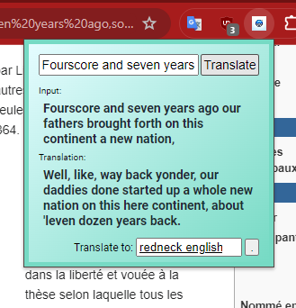
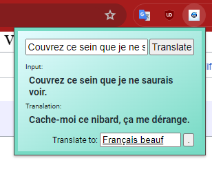

# GPT Translate Chrome Extension

GPT Translate is a Chrome extension that provides enhanced text translation capabilities by leveraging the power of Large Language Models (LLMs) like GPT-3.5-turbo.

## Screenshots

See GPT Translate in action:

- Translating a famous address of Abraham Lincoln into a "redneck" variant of English.


- Translating Molière's famous quote from Le Tartuffe into a more familiar, "beauf" variant of French.


## Features

- Contextual Translations: Utilizes GPT-3.5-turbo to understand the context of sentences for accurate translations, instead of using simpler translation engines like Google Translate, that often provide literal word-by-word translations.
- Custom Target Language: Allows users to specify their target language manually and remembers preferences. Madeup languages can be given or familiar variants of existing languages, such as "redneck English" or "
- Selection Capture: Automatically captures selected text from the current tab for translation, reducing the need to manually copy and paste text.

## User Installation

GPT Translate can be added to Chrome through the Chrome Web Store:

[TODO]: Add link to Chrome Web Store

Alternatively, you can manually install it by following these steps:

1. Clone this repository to your local machine.
2. Open Chrome and go to `chrome://extensions/`.
3. Enable Developer Mode by toggling the switch in the top-right corner.
4. Click on 'Load unpacked' and select the directory of your cloned repository.
5. The extension should now be added to your browser and ready to use.

## Development

This extension is built in vanilla JavaScript, utilizing the Chrome Extensions API to interact with browser content and a background service worker for asynchronous tasks.
Additional features and improvements might benefit from using a lightweight framework like Vue.js or React.js for more complex user interfaces.
The extension performs calls to a light Express.js backend that serves as a proxy to the OpenAI API, which is used to interact with the GPT-3.5-turbo model.

## Deployment

A valid OpenAI API key is required to deploy the backend and use the extension. The key should be stored in a `.env` file in the backend directory.

The `.env` file should look like this:

```
OPENAI_API_KEY='sk-XXXXXXXXXXXXXXXXXXXXXXXXXXXXXXXX'
```

The backend's main file is located in `./backend/index.js`. To deploy the backend, run the following commands:

```bash
cd backend
npm install
node index.js
```

## Contributions

Contributions are welcome! Please feel free to fork the repository, make your improvements, and submit a pull request.

## License

GPT Translate is released under the MIT License. See the LICENSE file for more details.
